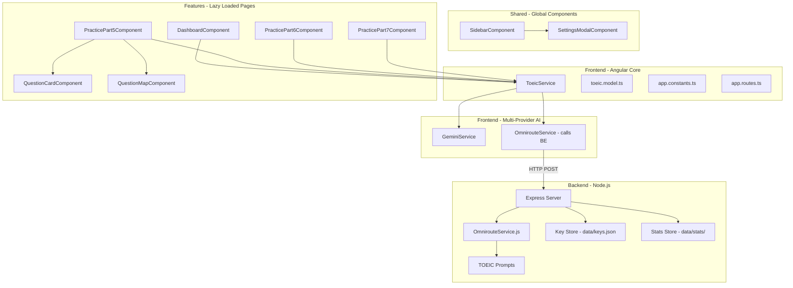
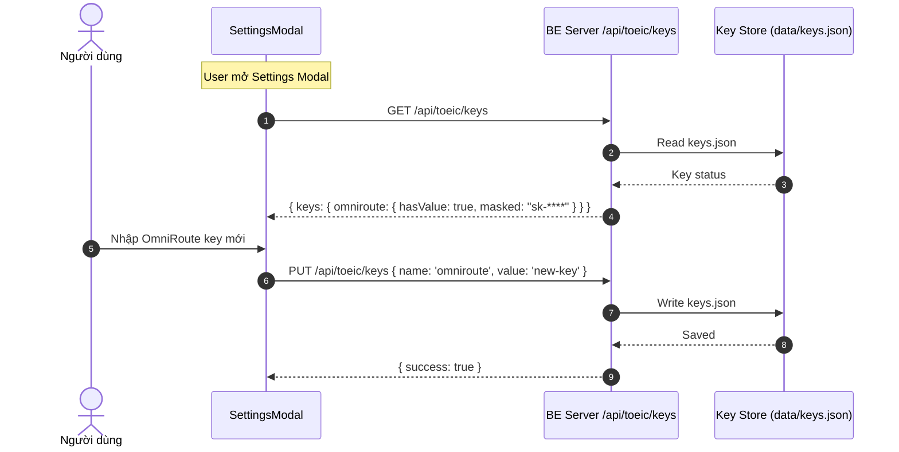
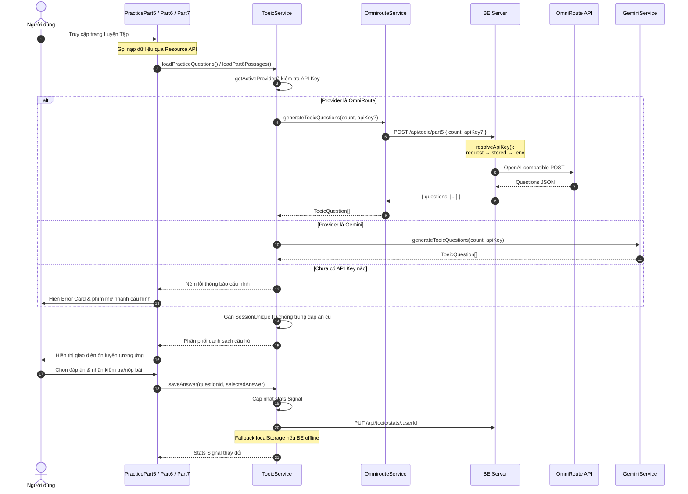

# TOEIC Master (Part 5, Part 6 & Part 7)

Ứng dụng học và ôn luyện TOEIC Reading bao gồm Part 5 (Incomplete Sentences), Part 6 (Text Completion) và Part 7 (Reading Comprehension) thông minh tích hợp đa nhà cung cấp AI (Multi-Provider Generative AI).

---

<details>
  <summary>📖 <strong>Tab 1: Giới thiệu Ứng dụng (Click để mở rộng)</strong></summary>
  <br>

**TOEIC Master** là ứng dụng hỗ trợ người học ôn luyện toàn diện phần ngữ pháp, từ vựng, điền câu và đọc hiểu thông qua các câu hỏi trắc nghiệm Part 5, các đoạn văn điền từ Part 6, và các đoạn đọc hiểu Part 7 bám sát cấu trúc đề thi thực tế.

### Các Tính Năng Nổi Bật:

- **Luyện tập Part 5 (Incomplete Sentences)**: Cung cấp đúng 30 câu hỏi ngẫu nhiên bám sát cấu trúc đề thi thật giúp rèn luyện phản xạ và tốc độ làm bài.
- **Luyện tập Part 6 (Text Completion - Giao diện Split-Screen)**:
  - Trình diễn các đoạn văn đọc hiểu hoàn chỉnh với 4 chỗ trống cần hoàn thiện.
  - **Tương tác Blank-Anchors**: Click vào các khoảng trống trong đoạn văn bên trái (ví dụ `[131]`, `[132]`...) sẽ tự động cuộn màn hình (`smooth-scroll`) và nhấp nháy tập trung (`highlight-flash`) vào thẻ câu hỏi trắc nghiệm tương ứng ở cột bên phải.
  - **Dịch nghĩa đoạn văn**: Hộp thoại dịch nghĩa toàn bộ đoạn văn tiếng Việt có thể ẩn/hiện linh hoạt hỗ trợ tối đa việc dịch nghĩa và ôn tập từ vựng ngữ cảnh.
- **Luyện tập Part 7 (Reading Comprehension - Giao diện Split-Screen)**:
  - **Mini-Test**: Luyện tập nhanh với 2 đoạn văn (1 Đơn và 1 Kép/Ba) gồm khoảng 8 - 10 câu hỏi.
  - **Full Mock Test**: Đầy đủ 54 câu hỏi (từ Câu 147 đến 200) gồm 15 đoạn văn (10 Đơn, 2 Kép, 3 Ba) đúng cấu trúc đề thi thật.
  - Hỗ trợ các loại passage: Single Passage, Double Passage, Triple Passage.
- **Tích hợp Đa Nhà cung cấp AI (Multi-Provider AI)**:
  - **Google Gemini** (Mô hình `gemini-2.5-flash`): Truy cập API miễn phí tại Google AI Studio.
  - **OmniRoute** (OpenAI-compatible API): Truy cập nhiều AI models miễn phí qua giao diện OpenAI-compatible tại `localhost:20128`.
  - OmniRoute key được lưu trên **Backend Server** và ưu tiên sử dụng nếu cả hai đều được cấu hình.
  - Tự động sinh câu hỏi và đoạn văn phong phú, chất lượng cao không giới hạn thông qua API Key.
  - Cung cấp bản dịch nghĩa tiếng Việt và giải thích lý do lựa chọn đáp án chi tiết cho từng câu hỏi đơn lẻ.
  - **Phiên làm bài độc nhất (Session Unique ID)**: Tự động đánh dấu mã định danh duy nhất cho từng câu hỏi được sinh ra ở mỗi phiên học, loại bỏ hoàn toàn lỗi tự động chọn đáp án cũ do trùng ID câu hỏi lịch sử.
- **Thống kê chi tiết (Dashboard)**: Theo dõi tiến độ học tập, tỷ lệ chính xác toàn cục và chi tiết theo 7 kỹ năng: **Ngữ pháp (Grammar)**, **Từ vựng (Vocabulary)**, **Từ loại (Word Forms)**, **Điền câu (Sentence Insertion)**, **Single Passage**, **Double Passage**, **Triple Passage**.
- **Giao diện Tối/Sáng hiện đại**: Hỗ trợ chuyển đổi nhanh chế độ hiển thị tối/sáng với hiệu ứng kính mờ (Glassmorphism) và các chuyển động mượt mà.
- **Tương thích Mobile**: Giao diện chân trang và sidebar được thiết kế chuẩn responsive tối ưu trên điện thoại di động và máy tính bảng.

</details>

<br>

<details>
  <summary>🛠️ <strong>Tab 2: Danh sách Công nghệ Sử dụng (Click để mở rộng)</strong></summary>
  <br>

### 🖥️ Backend (Node.js)

Dự án sử dụng **Backend Server** được xây dựng bằng Node.js/Express để xử lý các yêu cầu gọi OmniRoute API:

- **Express.js**: Web framework chính của BE.
- **CORS**: Cho phép giao tiếp cross-origin giữa UI (`localhost:4200`) và BE (`localhost:3000`).
- **dotenv**: Quản lý cấu hình qua file `.env`.
- **JSON File-based Key Store**: Lưu trữ API Key (OmniRoute) trên server tại `data/keys.json`, hỗ trợ GET/PUT/DELETE qua REST API.
- **JSON File-based Stats Store**: Lưu trữ thống kê người dùng trên server tại `data/stats/{userId}.json`, hỗ trợ multi-user, GET/PUT/DELETE qua REST API.

### 🎨 Frontend (Angular)

Dự án được xây dựng và tối ưu trên nền tảng các công nghệ frontend và tiền xử lý hiện đại nhất:

#### 🚀 Các tính năng Angular nổi bật đã áp dụng (Modern Angular Features):

- **Zoneless Change Detection (Angular 19+)**: Loại bỏ hoàn toàn thư viện `zone.js` truyền thống thông qua `provideZonelessChangeDetection()`, giúp tối ưu hóa hiệu năng render và giảm nhẹ dung lượng bundle của ứng dụng.
- **Modern Control Flow (`@if`, `@else`, `@for`) (Angular 17+)**: Thay thế hoàn toàn cú pháp directives cũ (`*ngIf` và `*ngFor`), tăng tốc biên dịch và kết xuất danh sách mà không cần import `CommonModule`.
- **Deferrable Views (`@defer`) (Angular 17+)**: Sử dụng cú pháp trì hoãn `@defer (on interaction(settingsBtn))` để chỉ tải xuống mã nguồn của component modal cấu hình AI khi người dùng tương tác trực tiếp với nút cấu hình.
- **Resource API (`resource()`) (Angular 19+)**: Quản lý tác vụ nạp câu hỏi và đoạn văn đọc hiểu bất đồng bộ từ AI API tự động thông qua cơ chế phản xạ (reactive) của Angular.
- **Signals & Signal Inputs/Outputs**: Sử dụng các writable signal, computed signal, inputs (`input()`), và outputs (`output()`) giúp đồng bộ dữ liệu một cách trực tiếp, phản xạ tức thì và tối ưu hiệu năng.
- **Trình đóng gói esbuild & Vite Builder (Angular 17+)**: Sử dụng cấu hình builder thế hệ mới `"@angular-devkit/build-angular:application"` cho tốc độ build esbuild vượt trội và hot reload tức thì qua Vite.

---

#### 🎨 Kiến trúc Style SCSS & Nhóm Biến Hệ Thống (Sass Features):

- **Sass Variables Single Source of Truth**: Tách riêng tệp cấu hình màu sắc, timing và font chữ cốt lõi tại `_variables.scss` làm gốc. Ánh xạ trực tiếp từ Sass variables sang CSS Custom Properties (`:root`) trong `styles.scss` giúp liên thông tốt giữa build-time và runtime (Light/Dark themes).
- **SCSS Mixins**: Xây dựng thư viện mixin tại `_mixins.scss` quản lý hiệu ứng kính mờ nâng cao (`glass-panel`) và chuẩn hóa nút bấm (`btn-theme`, `btn-base`), tránh duplicate code thiết kế.
- **Automated Badge Generator `@each` Loop**: Sử dụng cấu trúc Map của Sass phối hợp vòng lặp `@each` trong `_badges.scss` tự động biên dịch hàng loạt lớp huy hiệu tương ứng (`.badge-grammar`, `.badge-easy`...), rút gọn 70 dòng CSS thô.
- **Quy định Import hiện đại**: Sử dụng `@use 'sass:map'` và `@use 'variables' as v` loại bỏ `@import` đã lỗi thời giúp tương thích tốt với Dart Sass 3.0.
- **Phân rã Modular stylesheets**: Chia nhỏ tệp style toàn cục thành 6 tệp partials riêng biệt (`_theme.scss`, `_reset.scss`, `_layout.scss`, `_animations.scss`, `_badges.scss`, `_shimmer.scss`) giúp quản lý và bảo trì dự án dễ dàng hơn.

</details>

<br>

<details>
  <summary>🏗️ <strong>Tab 3: Mô hình Kiến trúc & Luồng hoạt động (Click để mở rộng)</strong></summary>
  <br>

Ứng dụng được thiết kế dựa trên mô hình kiến trúc sạch (Clean Architecture) với 2 phần: **Backend Server** (Node.js) và **Frontend UI** (Angular).

### 1. Mô hình Kiến trúc (Architecture Pattern)

#### Backend (`toeic-reading-be`)

- **`src/server.js`**: Entry point — Express server với CORS, JSON middleware, routes mounting.
- **`src/routes/toeic.routes.js`**: API routes cho TOEIC generation (`POST /api/toeic/part5`, `/part6`, `/part7`). Chứa logic `resolveApiKey()` theo priority: request body → BE key store → `.env` default.
- **`src/routes/keys.routes.js`**: REST API quản lý API Keys (`GET/PUT/DELETE /api/toeic/keys`).
- **`src/services/omniroute.service.js`**: Gọi OmniRoute API trực tiếp, gửi prompts và nhận responses.
- **`src/prompts/toeic.prompts.js`**: Prompt templates cho Part 5, 6, 7.
- **`src/db/key-store.js`**: JSON file-based key store lưu tại `data/keys.json`.

#### Frontend (`toeic-reading-ui`)

- **Cấu hình & Routers (`src/app/core/routers/`)**: Chứa tệp định tuyến chính `app.routes.ts`.
- **Hệ thống Style (`src/app/core/styles/`)**: Nơi tập hợp tất cả các stylesheet partials phân rã và tệp điều phối chính `styles.scss`.
- **Thư mục Features (`src/app/features/`)**: Chứa 4 trang chức năng độc lập tải trì hoãn (Lazy Loaded):
  - `dashboard`: Tổng hợp dữ liệu thống kê phản xạ.
  - `practice-part5`: Ôn luyện 30 câu hỏi trắc nghiệm đơn lẻ.
  - `practice-part6`: Ôn luyện các đoạn văn đọc điền từ với blank-anchors.
  - `practice-part7`: Ôn luyện đọc hiểu với Mini-Test và Full Mock Test.
- **Singleton Service**: `ToeicService` đóng vai trò quản lý State tập trung bằng Signal. Thống kê lưu trên **Backend Server** (fallback localStorage khi BE offline).
- **Multi-Provider AI Services**: Hỗ trợ đồng thời nhiều nhà cung cấp AI:
  - `GeminiService` — Gọi Google Gemini API (REST API trực tiếp từ UI).
  - `OmnirouteService` — Gọi BE Server (`localhost:3000`) để thực hiện OmniRoute API calls.
  - `ToeicService` tự động chọn provider dựa trên API Key đã cấu hình (OmniRoute ưu tiên).



### 2. Luồng hoạt động Luyện tập (Workflows)

- **Luồng Sinh & Chấm điểm**:
  - Học viên truy cập vào chức năng Luyện tập Part 5, Part 6 hoặc Part 7.
  - `Resource API` tự động gọi `ToeicService` nạp nội dung. Hệ thống sinh mã định danh duy nhất (`question.id-sessionId`) để đóng gói câu hỏi độc lập.
  - `ToeicService` chọn AI provider dựa trên API Key đã cấu hình (OmniRoute ưu tiên, Gemini dự phòng).
  - **OmniRoute flow**: `ToeicService` → `OmnirouteService` → BE Server → OmniRoute API → Kết quả trả về UI.
  - **Gemini flow**: `ToeicService` → `GeminiService` → Google Gemini API trực tiếp → Kết quả trả về UI.
  - Mô hình AI trả về dữ liệu cấu trúc chuẩn JSON, được cache vào map và hiển thị lên giao diện.
  - Khi nộp bài, `ToeicService.saveAnswer()` nhận dữ liệu, tính toán tỉ lệ chính xác và ghi nhận trực tiếp vào Signal lịch sử `stats` toàn cục.

### 3. API Key Management Flow





</details>

<br>

<details>
  <summary>🤖 <strong>Tab 4: Agentic Workspace & Quy trình Phát triển (Click để mở rộng)</strong></summary>
  <br>

Dự án tích hợp cấu hình **Agentic Workspace** tại thư mục `.agents/` để định hướng cho các AI coding assistants cộng tác lập trình hiệu quả, tuân thủ đúng các tiêu chuẩn công nghệ của dự án.

### 📋 Quy trình Phối hợp (Orchestration Workflows)

Mọi tác vụ sửa đổi code đều được quản lý tự động qua quy trình mô tả trong `.agents/AGENTS.md`:

1.  **Phân loại tác vụ**: Xác định loại workflow (`bug-fix`, `feature-delivery`, `refactor`, `code-review`, `jira-review`).
2.  **Lập kế hoạch (Approval Gate)**: Agent bắt buộc phải tạo bản thiết kế `implementation_plan.md` và đợi lập trình viên duyệt trước khi thay đổi code.
3.  **Kiểm tra & Xác thực tự động (Validation)**:
    - Tự động format mã nguồn qua Prettier hook: `npx prettier --write "src/**/*.{ts,html,scss}"`.
    - Chạy kiểm thử unit test qua Vitest: `npx vitest run`.
    - Kiểm tra biên dịch sản phẩm: `npm run build`.

---

### 📏 Quy tắc Lập trình (Coding & Styling Standards)

Các Agent tham gia phát triển dự án bắt buộc phải tuân thủ bộ luật lưu trữ tại `.agents/rules/`:

- **Tái sử dụng tài nguyên (Coding Style)**: Bắt buộc tìm kiếm và tái sử dụng các asset dùng chung trong `src/app/core/` (constants, models, services) trước khi định nghĩa mới.
- **Đặc tả Angular**: Luôn sử dụng Standalone Component, cơ chế phản xạ Signals, `resource()` API để tải dữ liệu, và chiến lược kết xuất `OnPush`.
- **Đặc tả Stylesheet**: Sử dụng Sass modular `@use`, tuyệt đối không dùng `@import`, bắt buộc dùng CSS Custom Properties và SCSS Mixins toàn cục, cấm duplicate badge styles hoặc hardcode mã màu.

</details>

---

## 🚀 Hướng dẫn khởi chạy dự án

### 1. Backend Server (`toeic-reading-be`)

#### Cài đặt dependencies:

```bash
cd toeic-reading-be
npm install
```

#### Cấu hình:

Tạo file `.env` trong thư mục gốc:

```env
# OmniRoute API Configuration
OMNIROUTE_MODEL=oc/deepseek-v4-flash-free
OMNIROUTE_API_BASE_URL=http://localhost:20128/v1
# Default API key - UI có thể override bằng key riêng
OMNIROUTE_API_KEY=

# Server Configuration
PORT=3000
```

#### Khởi chạy BE:

```bash
npm start
```

BE sẽ chạy tại: `http://localhost:3000`

#### API Endpoints:

| Method | Endpoint | Body | Mô tả |
|--------|----------|------|-------|
| `GET` | `/api/toeic/keys` | — | Liệt kê status API keys (masked) |
| `PUT` | `/api/toeic/keys` | `{ name, value }` | Lưu/cập nhật API key |
| `DELETE` | `/api/toeic/keys/:name` | — | Xóa API key |
| `GET` | `/api/toeic/stats/:userId` | — | Lấy thống kê user |
| `PUT` | `/api/toeic/stats/:userId` | `{ stats }` | Lưu thống kê user |
| `DELETE` | `/api/toeic/stats/:userId` | — | Xóa thống kê user |
| `POST` | `/api/toeic/part5` | `{ count, apiKey? }` | Sinh câu hỏi Part 5 |
| `POST` | `/api/toeic/part6` | `{ count, apiKey? }` | Sinh đoạn văn Part 6 |
| `POST` | `/api/toeic/part7` | `{ passageType, count, startQuestionNumber, apiKey? }` | Sinh đoạn văn Part 7 |
| `GET` | `/api/health` | — | Health check |

#### API Key Resolution Priority:

1. `apiKey` từ request body (UI override)
2. Stored key từ BE key store (`data/keys.json`)
3. Default key từ `.env` (`OMNIROUTE_API_KEY`)

---

### 2. Frontend UI (`toeic-reading-ui`)

#### Cài đặt dependencies:

```bash
cd toeic-reading-ui
npm install
```

#### Khởi chạy UI:

```bash
npm start
```

Truy cập ứng dụng tại: `http://localhost:4200/`

---

### 3. Cấu hình AI Provider:

1. Đảm bảo BE đang chạy (`http://localhost:3000`).
2. Mở sidebar → chọn **Cấu hình** (nút ⚙️).
3. Nhập API Key cho **OmniRoute** (key sẽ được lưu trên BE) và/hoặc **Google Gemini** (key lưu trên browser).
4. Nhấn **Kiểm tra kết nối** để xác nhận API Key hợp lệ.
5. Nhấn **Lưu lại** để bắt đầu luyện tập.

**Lưu ý**:
- OmniRoute key được lưu trên **Backend Server** (file `data/keys.json`) và ưu tiên sử dụng nếu cả hai provider đều được cấu hình.
- Gemini key được lưu trên **localStorage** của browser (do gọi trực tiếp Google API, không qua BE).
- Nếu đã cấu hình `OMNIROUTE_API_KEY` trong file `.env` của BE, UI không cần nhập key OmniRoute nữa.